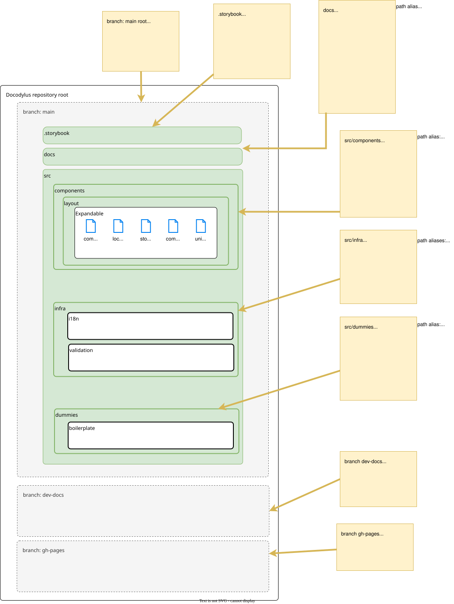

# Code Organization

## Components
Individual components in Docodylus are co-located with all of the files needed to use, test, and demonstrate the component. Typically, this includes:

* the component itself: `<Component>.tsx`
* A Vitest unit-tests file: `<Component>.test.tsx`
* A `locales` folder containing translations for any public facing strings
* A `storybook` folder containing:
    * A collection of Storybook stories demonstrating the component:  `<Component>.stories.tsx`
    * A markdown file consisting of documentation for the component:  `<Compoent>.docs.mdx`

## Infra
Infra contains modules for cross-cutting concerns. Each folder beneath `Infra` should behave as an independent module, with other modules interacting via a defined API.

## Documentation
This repository contains two sets of documentation

1. User Docs
    * Published on `iaindavis.dev` with Storybook (pending)
    * Documentation source for Docodylus as a whole is in the root level `docs` folder
    * Documentation source for individual components is defined in `.docs.mdx` files alongside the component definitions
2. Developer Docs
    * Published on `iaindavis-dev.github.io/dococylus` (for now) with MKDocs
    * Source is in an isolated branch of the repository: `dev-docs`
    * Source is published to Github Pages via another isolated branch: `gh-pages`

## Path Aliases {: title="This is a tooltip"}
Several path aliases are defined to simplify using elements in different modules.

Path variables are defined in Vite, Typescript, Storybook, and Vitest, so you should be able to use the same set of aliases throughout the code base.

Path variables are defined in `tsconfig.json` and must be kept in sync with the duplicated definition in `.storybook/main.js`

| alias       | actual path     | purpose                                                                                                                           |
|-------------|-----------------|-----------------------------------------------------------------------------------------------------------------------------------|
| @components | /src/components | home of the components that make up the bulk of the library                                                                       |
| @docs       | /docs           | home of the **User** docs for **Docodylus** as a whole                                                                            |
| @dummies    | /src/dummies    | home of static text and other files used as boilerplate, mock API responses, etc. both for testing and for demonstration purposes |
| @i18n           | /src/infra/i18n           | home of the Internationalization module |
| @validation | /src/validation | home of general validation utilities |

